# CareerForge

A career portal desktop application built in Java that connects students with employers through job postings, applications, and personalized recommendations. The system demonstrates eight Gang-of-Four design patterns working together in a real-world domain.

---

## Features

**Students**
- Register, log in, and build a structured resume (education, experience, projects, skills, certifications)
- Browse all job listings with pagination or filter by type, location, or skill
- Receive personalized job recommendations based on skill match, major, or location preference
- Apply for jobs and enhance applications with cover letters, portfolios, referrals, or recommendation letters
- Track application status through a full lifecycle (Draft → Submitted → Under Review → Interview → Offer → Accepted/Rejected)
- Receive real-time notifications when application status changes or new postings appear

**Employers**
- Register and post Internship, Co-Op, or Full-Time job openings
- View all applications received for posted jobs
- Update application statuses and trigger automated student notifications

**Admins**
- View a dashboard of all students, employers, and job postings
- Generate system-wide reports

**Persistence**
- All data is saved to and loaded from JSON files on startup and shutdown via Gson

---

## Tech Stack

| Layer | Technology                |
|---|---------------------------|
| Language | Java 25                   |
| GUI | Java Swing                |
| Serialization | Gson 2.10.1               |
| Build | Maven (`pom.xml`)         |
| Storage | JSON flat files (`data/`) |

---

## Project Structure

Packages are organized by **domain** (what the code does), not by design pattern (how it does it).

```
careerforge/
├── pom.xml
├── data/
│   ├── applications.json
│   ├── employers.json
│   ├── jobpostings.json
│   └── students.json
└── src/
    ├── main/
    │   ├── java/
    │   │   └── com/careerforge/
    │   │       ├── Main.java
    │   │       │
    │   │       ├── portal/                   ← core system singleton
    │   │       │   └── CareerPortal.java
    │   │       │
    │   │       ├── user/                     ← user management domain
    │   │       │   ├── User.java
    │   │       │   ├── Student.java
    │   │       │   ├── Employer.java
    │   │       │   └── Admin.java
    │   │       │
    │   │       ├── job/                      ← job listing domain
    │   │       │   ├── JobPosting.java
    │   │       │   ├── JobPostingFactory.java
    │   │       │   ├── InternshipPosting.java
    │   │       │   ├── InternshipFactory.java
    │   │       │   ├── CoOpPosting.java
    │   │       │   ├── CoOpFactory.java
    │   │       │   ├── FullTimePosting.java
    │   │       │   ├── FullTimeFactory.java
    │   │       │   ├── JobCollection.java
    │   │       │   ├── JobIterator.java
    │   │       │   ├── JobListingCollection.java
    │   │       │   ├── JobListingIterator.java
    │   │       │   └── FilteredJobIterator.java
    │   │       │
    │   │       ├── application/              ← application lifecycle domain
    │   │       │   ├── ApplicationComponent.java
    │   │       │   ├── ApplicationDecorator.java
    │   │       │   ├── BaseApplication.java
    │   │       │   ├── CoverLetterDecorator.java
    │   │       │   ├── PortfolioDecorator.java
    │   │       │   ├── RecommendationDecorator.java
    │   │       │   ├── ReferralDecorator.java
    │   │       │   ├── ApplicationState.java
    │   │       │   ├── DraftState.java
    │   │       │   ├── SubmittedState.java
    │   │       │   ├── UnderReviewState.java
    │   │       │   ├── InterviewState.java
    │   │       │   ├── OfferState.java
    │   │       │   ├── AcceptedState.java
    │   │       │   ├── RejectedState.java
    │   │       │   └── WithdrawnState.java
    │   │       │
    │   │       ├── resume/                   ← resume management domain
    │   │       │   ├── Resume.java
    │   │       │   ├── ResumeBuilder.java
    │   │       │   ├── Education.java
    │   │       │   ├── Experience.java
    │   │       │   └── Project.java
    │   │       │
    │   │       ├── recommendation/           ← recommendation domain
    │   │       │   ├── RecommendationStrategy.java
    │   │       │   ├── RecommendationEngine.java
    │   │       │   ├── SkillMatchStrategy.java
    │   │       │   ├── MajorMatchStrategy.java
    │   │       │   └── LocationMatchStrategy.java
    │   │       │
    │   │       ├── notification/             ← event notification domain
    │   │       │   ├── EventListener.java
    │   │       │   ├── EventManager.java
    │   │       │   ├── StudentNotificationListener.java
    │   │       │   ├── EmployerNotificationListener.java
    │   │       │   └── AdminNotificationListener.java
    │   │       │
    │   │       ├── ui/                       ← Swing presentation layer
    │   │       │   ├── CareerForgeSwingApp.java
    │   │       │   ├── MainMenu.java
    │   │       │   ├── StudentMenu.java
    │   │       │   ├── EmployerMenu.java
    │   │       │   └── AdminMenu.java
    │   │       │
    │   │       └── util/                     ← shared utilities
    │   │           ├── SkillUtils.java
    │   │           └── ValidationUtils.java
    │   │
    │   └── resources/
    └── test/
        └── java/
```

---

## Design Patterns

Eight Gang-of-Four patterns are implemented. Each is mapped to its business purpose below.

### 1. Singleton — `CareerPortal`

`CareerPortal` is the single shared registry for the entire system. It holds all students, employers, job postings, and applications, and owns the `EventManager`. A single instance is created on first access and reused throughout the application lifetime.

```java
CareerPortal portal = CareerPortal.getInstance();
```

**Why:** The portal is global shared state — multiple menus and services need access to the same data without passing it around explicitly.

---

### 2. Builder — `ResumeBuilder`

Constructing a `Resume` requires optional and ordered parts (education, skills, experiences, projects, certifications). `ResumeBuilder` provides a fluent interface that assembles these incrementally and returns a fully-formed `Resume` only when `build()` is called.

```java
Resume resume = new ResumeBuilder()
    .setEducation(education)
    .addSkill("Java")
    .addExperience(exp)
    .addProject(proj)
    .addCertification("AWS")
    .build();
```

**Why:** Avoids a constructor with many nullable parameters and ensures a `Resume` is only used after it is fully assembled.

---

### 3. Factory Method — `JobPostingFactory`

Job postings come in three types, each with different fields. `JobPostingFactory` is an abstract factory; three concrete subclasses override `createPosting()` to build the right type from a map of details.

```
JobPostingFactory (abstract)
├── InternshipFactory  →  InternshipPosting  (stipend, duration, academic credit)
├── CoOpFactory        →  CoOpPosting        (rotation cycle, duration months)
└── FullTimeFactory    →  FullTimePosting    (salary range, benefits, signing bonus)
```

**Why:** Posting creation logic is isolated per type. Adding a new posting type requires only a new factory and posting class — no existing code changes.

---

### 4. Strategy — `RecommendationEngine`

Job recommendations are scored differently depending on what the student cares about. `RecommendationStrategy` defines a `calculateScore()` contract; three concrete strategies implement it. `RecommendationEngine` holds the active strategy and can swap it at runtime.

```
RecommendationStrategy (interface)
├── SkillMatchStrategy     →  scores by skill overlap
├── MajorMatchStrategy     →  scores by preferred major match
└── LocationMatchStrategy  →  scores by preferred location match
```

**Why:** Recommendation logic is swappable without changing the engine. The UI can let users pick a strategy and results change immediately.

---

### 5. State — `ApplicationState`

An application moves through a defined lifecycle. Each state class implements `ApplicationState` and exposes only the transitions valid from that point. `BaseApplication` delegates all behavior to its current state object.

```
Draft → Submitted → UnderReview → Interview → Offer → Accepted
                ↘               ↘           ↘       ↘
              Withdrawn        Rejected   Rejected  Rejected/Withdrawn
```

**Why:** Eliminates large if/switch blocks. Each state class is responsible only for its own valid transitions, making illegal moves impossible.

---

### 6. Decorator — `ApplicationDecorator`

A base application can be enriched with optional extras. `ApplicationDecorator` wraps any `ApplicationComponent`; concrete decorators add description and increase application strength.

```
BaseApplication          (strength = 10)
└── CoverLetterDecorator (+15)
    └── PortfolioDecorator (+20)
        └── ReferralDecorator (+25)
```

**Why:** Enhancements compose freely in any order and combination without modifying `BaseApplication` or creating a subclass per combination.

---

### 7. Observer — `EventManager`

`EventManager` maps event type strings to lists of `EventListener` subscribers. When significant events occur, the portal calls `notify()` and every registered listener receives it.

| Event | Listeners notified |
|---|---|
| `APPLICATION_SUBMITTED` | Employer |
| `APPLICATION_STATUS_CHANGED` | Student, Employer |
| `JOB_POSTED` | All students |
| `SYSTEM_ALERT` | Admin |

Students and employers are auto-subscribed when they register with `CareerPortal`.

**Why:** Decouples event producers from consumers. New notification types or listener types require no changes to existing code.

---

### 8. Iterator — `JobListingCollection`

`JobListingCollection` creates two iterator types on demand: a paginated `JobListingIterator` for standard browsing and a `FilteredJobIterator` that applies a filter before iterating. Both implement `JobIterator`.

```java
// Paginated browsing
JobIterator it = collection.createIterator();

// Filtered by type, location, or skill
JobIterator it = collection.createFilteredIterator("location", "Boston");
```

**Why:** The UI browses job listings without knowing the underlying list structure, and filter logic is contained inside the iterator rather than scattered across menus.

---

## How to Run

**Prerequisites:** Java 17+, Maven 3.6+

```bash
# Compile and run
mvn compile exec:java

# Build a standalone fat JAR, then run
mvn package
java -jar target/careerforge.jar
```

Run from the project root so that relative paths to `data/*.json` resolve correctly.

---

## Data Persistence

On startup, `CareerPortal.loadData()` reads four JSON files from `data/`. A JVM shutdown hook calls `saveData()` automatically when the application exits — no manual save needed.

| File | Contents |
|---|---|
| `data/students.json` | Student profiles and resumes |
| `data/employers.json` | Employer profiles |
| `data/jobpostings.json` | All job postings (type detected from fields present) |
| `data/applications.json` | All applications with current state |

---

## Architecture Diagram

```mermaid
classDiagram
    direction TB

    %% ========== SINGLETON ==========
    class CareerPortal {
        -CareerPortal instance$
        -Map~String, Student~ studentMap
        -Map~String, Employer~ employerMap
        -List~JobPosting~ jobPostings
        -List~BaseApplication~ applications
        -EventManager eventManager
        -CareerPortal()
        +getInstance()$ CareerPortal
        +registerStudent(Student)
        +registerEmployer(Employer)
        +addJobPosting(JobPosting)
        +addApplication(BaseApplication)
        +getJobPostings() List~JobPosting~
        +getStudentById(String) Student
        +getEmployerById(String) Employer
        +getApplicationsForStudent(String) List~BaseApplication~
        +getAllStudents() Map~String, Student~
        +getAllEmployers() Map~String, Employer~
        +saveData() void
        +loadData() void
    }

    %% ========== USER HIERARCHY ==========
    class User {
        <<abstract>>
        #String userId
        #String firstName
        #String lastName
        #String email
        #String password
        +getUserId() String
        +getFirstName() String
        +getLastName() String
        +getEmail() String
    }

    class Student {
        -String major
        -double gpa
        -int graduationYear
        -Resume resume
        -List~BaseApplication~ applications
        +getResume() Resume
        +setResume(Resume)
        +addApplication(BaseApplication)
        +getApplications() List~BaseApplication~
    }

    class Employer {
        -String companyName
        -List~JobPosting~ postedJobs
        +postJob(JobPosting)
        +getPostedJobs() List~JobPosting~
    }

    class Admin {
        -String role
        +viewDashboard()
        +generateReport()
    }

    User <|-- Student
    User <|-- Employer
    User <|-- Admin

    %% ========== BUILDER ==========
    class Resume {
        -Education education
        -List~String~ skills
        -List~Experience~ experiences
        -List~Project~ projects
        -List~String~ certifications
        +getEducation() Education
        +getSkills() List~String~
        +getExperiences() List~Experience~
        +getProjects() List~Project~
        +getCertifications() List~String~
    }

    class ResumeBuilder {
        -Resume resume
        +ResumeBuilder()
        +setEducation(Education) ResumeBuilder
        +addSkill(String) ResumeBuilder
        +addExperience(Experience) ResumeBuilder
        +addProject(Project) ResumeBuilder
        +addCertification(String) ResumeBuilder
        +build() Resume
    }

    class Education {
        -String university
        -String degree
        -double gpa
    }

    class Experience {
        -String company
        -String role
        -String duration
        -String description
    }

    class Project {
        -String name
        -String technologies
        -String description
    }

    ResumeBuilder ..> Resume : builds
    Resume *-- Education
    Resume o-- Experience
    Resume o-- Project
    Student *-- Resume

    %% ========== FACTORY METHOD ==========
    class JobPosting {
        <<interface>>
        +getJobId() String
        +getTitle() String
        +getCompany() String
        +getLocation() String
        +getRequiredSkills() List~String~
        +getPreferredMajor() String
        +getDeadline() Date
        +getStatus() String
        +getType() String
    }

    class InternshipPosting {
        -String jobId
        -String title
        -String company
        -String location
        -List~String~ requiredSkills
        -String preferredMajor
        -Date deadline
        -String status
        -String duration
        -double stipend
        -boolean academicCredit
    }

    class CoOpPosting {
        -String jobId
        -String title
        -String company
        -String location
        -List~String~ requiredSkills
        -String preferredMajor
        -Date deadline
        -String status
        -String rotationCycle
        -int durationMonths
    }

    class FullTimePosting {
        -String jobId
        -String title
        -String company
        -String location
        -List~String~ requiredSkills
        -String preferredMajor
        -Date deadline
        -String status
        -double salaryMin
        -double salaryMax
        -boolean hasBenefits
        -double signingBonus
    }

    class JobPostingFactory {
        <<abstract>>
        +createPosting(Map~String,String~ details)* JobPosting
    }

    class InternshipFactory {
        +createPosting(Map~String,String~ details) JobPosting
    }

    class CoOpFactory {
        +createPosting(Map~String,String~ details) JobPosting
    }

    class FullTimeFactory {
        +createPosting(Map~String,String~ details) JobPosting
    }

    JobPosting <|.. InternshipPosting
    JobPosting <|.. CoOpPosting
    JobPosting <|.. FullTimePosting
    JobPostingFactory <|-- InternshipFactory
    JobPostingFactory <|-- CoOpFactory
    JobPostingFactory <|-- FullTimeFactory
    JobPostingFactory ..> JobPosting : creates

    %% ========== STRATEGY ==========
    class RecommendationStrategy {
        <<interface>>
        +calculateScore(BaseApplication) int
    }

    class SkillMatchStrategy {
        +calculateScore(BaseApplication) int
    }

    class MajorMatchStrategy {
        -String targetMajor
        +calculateScore(BaseApplication) int
    }

    class LocationMatchStrategy {
        -String preferredLocation
        +calculateScore(BaseApplication) int
    }

    class RecommendationEngine {
        -RecommendationStrategy strategy
        +setStrategy(RecommendationStrategy)
        +recommend(Student, List~JobPosting~) List~JobPosting~
    }

    RecommendationStrategy <|.. SkillMatchStrategy
    RecommendationStrategy <|.. MajorMatchStrategy
    RecommendationStrategy <|.. LocationMatchStrategy
    RecommendationEngine o-- RecommendationStrategy

    %% ========== STATE ==========
    class ApplicationState {
        <<interface>>
        +submit(BaseApplication)
        +review(BaseApplication)
        +scheduleInterview(BaseApplication)
        +makeOffer(BaseApplication)
        +accept(BaseApplication)
        +reject(BaseApplication)
        +withdraw(BaseApplication)
        +getStateName() String
    }

    class DraftState {
        +submit(BaseApplication)
        +withdraw(BaseApplication)
        +getStateName() String
    }

    class SubmittedState {
        +review(BaseApplication)
        +withdraw(BaseApplication)
        +getStateName() String
    }

    class UnderReviewState {
        +scheduleInterview(BaseApplication)
        +reject(BaseApplication)
        +withdraw(BaseApplication)
        +getStateName() String
    }

    class InterviewState {
        +makeOffer(BaseApplication)
        +reject(BaseApplication)
        +withdraw(BaseApplication)
        +getStateName() String
    }

    class OfferState {
        +accept(BaseApplication)
        +reject(BaseApplication)
        +withdraw(BaseApplication)
        +getStateName() String
    }

    class AcceptedState {
        +getStateName() String
    }

    class RejectedState {
        +getStateName() String
    }

    class WithdrawnState {
        +getStateName() String
    }

    ApplicationState <|.. DraftState
    ApplicationState <|.. SubmittedState
    ApplicationState <|.. UnderReviewState
    ApplicationState <|.. InterviewState
    ApplicationState <|.. OfferState
    ApplicationState <|.. AcceptedState
    ApplicationState <|.. RejectedState
    ApplicationState <|.. WithdrawnState

    %% ========== APPLICATION + DECORATOR ==========
    class ApplicationComponent {
        <<interface>>
        +getDescription() String
        +getStrength() int
    }

    class BaseApplication {
        -String applicationId
        -Student student
        -JobPosting job
        -Resume resume
        -ApplicationState currentState
        -List~String~ statusHistory
        +getDescription() String
        +getStrength() int
        +getApplicationId() String
        +getCurrentState() ApplicationState
        +setState(ApplicationState)
        +addStatusEntry(String)
    }

    class ApplicationDecorator {
        <<abstract>>
        #ApplicationComponent wrappedComponent
        +ApplicationDecorator(ApplicationComponent)
        +getDescription() String
        +getStrength() int
    }

    class CoverLetterDecorator {
        -String coverLetterText
        +getDescription() String
        +getStrength() int
    }

    class PortfolioDecorator {
        -String portfolioUrl
        +getDescription() String
        +getStrength() int
    }

    class ReferralDecorator {
        -String referrerName
        -String referrerEmail
        -String referrerTitle
        +getDescription() String
        +getStrength() int
    }

    class RecommendationDecorator {
        -String recommenderName
        -String letterContent
        +getDescription() String
        +getStrength() int
    }

    ApplicationComponent <|.. BaseApplication
    ApplicationComponent <|.. ApplicationDecorator
    ApplicationDecorator <|-- CoverLetterDecorator
    ApplicationDecorator <|-- PortfolioDecorator
    ApplicationDecorator <|-- ReferralDecorator
    ApplicationDecorator <|-- RecommendationDecorator
    ApplicationDecorator o-- ApplicationComponent : wraps
    BaseApplication o-- ApplicationState : currentState

    %% ========== OBSERVER ==========
    class EventManager {
        -Map~String, List~EventListener~~ listeners
        +subscribe(String eventType, EventListener)
        +unsubscribe(String eventType, EventListener)
        +notify(String eventType, Object data)
    }

    class EventListener {
        <<interface>>
        +update(String eventType, Object data)
    }

    class StudentNotificationListener {
        -Student student
        +update(String eventType, Object data)
    }

    class EmployerNotificationListener {
        -Employer employer
        +update(String eventType, Object data)
    }

    class AdminNotificationListener {
        -Admin admin
        +update(String eventType, Object data)
    }

    EventListener <|.. StudentNotificationListener
    EventListener <|.. EmployerNotificationListener
    EventListener <|.. AdminNotificationListener
    EventManager o-- EventListener

    %% ========== ITERATOR ==========
    class JobIterator {
        <<interface>>
        +hasNext() boolean
        +next() JobPosting
        +reset()
    }

    class JobListingIterator {
        -List~JobPosting~ jobs
        -int position
        -int pageSize
        +hasNext() boolean
        +next() JobPosting
        +reset()
        +getCurrentPage() int
    }

    class FilteredJobIterator {
        -List~JobPosting~ filteredJobs
        -int position
        -String filterType
        -String filterValue
        +hasNext() boolean
        +next() JobPosting
        +reset()
        +applyFilter(List~JobPosting~) List~JobPosting~
    }

    class JobCollection {
        <<interface>>
        +createIterator() JobIterator
    }

    class JobListingCollection {
        -List~JobPosting~ jobs
        +createIterator() JobIterator
        +createFilteredIterator(String, String) JobIterator
        +addJob(JobPosting)
    }

    JobIterator <|.. JobListingIterator
    JobIterator <|.. FilteredJobIterator
    JobCollection <|.. JobListingCollection
    JobListingCollection ..> JobIterator : creates

    %% ========== SERVICE & UI ==========
    class Main {
        +main(String[] args)$ void
    }

    class MainMenu {
        -Scanner scanner
        +display() void
        +handleStudentRegistration() void
        +handleStudentLogin() void
        +handleEmployerLogin() void
        +handleAdminLogin() void
    }

    class StudentMenu {
        -Scanner scanner
        -Student currentStudent
        +display() void
        +browseJobs() void
        +getRecommendations() void
        +applyForJob() void
        +viewApplications() void
        +enhanceApplication() void
        +findMentor() void
        +viewNotifications() void
    }

    class EmployerMenu {
        -Scanner scanner
        -Employer currentEmployer
        +display() void
        +postNewJob() void
        +viewPostedJobs() void
        +viewApplications() void
        +viewNotifications() void
    }

    class AdminMenu {
        -Scanner scanner
        -Admin currentAdmin
        +display() void
        +viewDashboard() void
        +viewAllStudents() void
        +viewAllEmployers() void
        +viewAllJobPostings() void
        +generateReport() void
    }

    Main ..> CareerPortal : gets instance
    Main ..> MainMenu : launches
    MainMenu ..> CareerPortal : reads/writes
    MainMenu ..> StudentMenu : opens
    MainMenu ..> EmployerMenu : opens
    MainMenu ..> AdminMenu : opens
    StudentMenu ..> CareerPortal : reads/writes
    StudentMenu ..> ResumeBuilder : uses
    StudentMenu ..> RecommendationEngine : uses
    StudentMenu ..> JobListingCollection : uses
    EmployerMenu ..> CareerPortal : reads/writes
    EmployerMenu ..> JobPostingFactory : uses
    AdminMenu ..> CareerPortal : reads

    %% ========== KEY RELATIONSHIPS ==========
    CareerPortal o-- Student
    CareerPortal o-- Employer
    CareerPortal o-- JobPosting
    CareerPortal o-- BaseApplication
    CareerPortal *-- EventManager
    Student o-- BaseApplication
    Employer o-- JobPosting
    BaseApplication --> Student
    BaseApplication --> JobPosting
```


